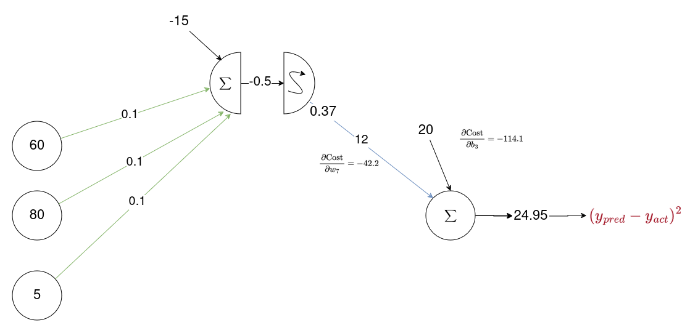
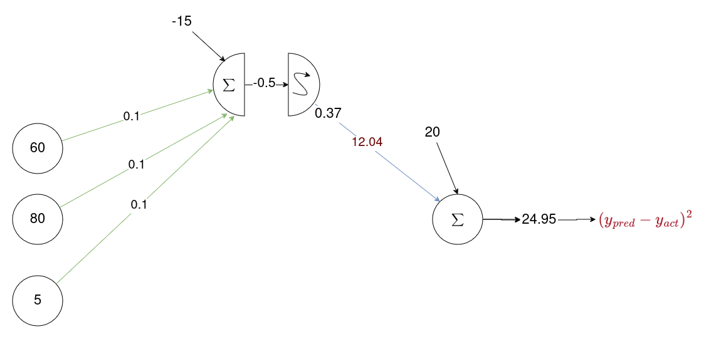

# General

Este es un ejemplo que actualiza solo un peso de la capa de entrada a la capa oculta de una red. $w_1$

# Base de datos

En esta base de datos las $x$ son las horas estudiadas y la $y$ es la calificación obtenida. Estaremos haciendo una regresión obteniendo un único valor.

| Estudiante | $x_1$ | $x_2$ | $x_3$ | $y_{act}$  |
|---------|----|----|----|----|
| 1       | 60 | 80 | 5  | 82 |
| 2       | 70 | 75 | 8  | 94 |
| 3       | 40 | 51 | 10 | 45 |

# Propagación

| Estudiante | $x_1$ | $x_2$ | $x_3$ | $y_{act}$  |
|---------|----|----|----|----|
| 1       | 60 | 80 | 5  | 82 |

> Los $pesos$ y $sesgos$ son inicializados aleatoriamente

#### Operación lineal

$z_1 = (w_1 \cdot x_1) + (w_3 \cdot x_2) + (w_5 \cdot x_3) + b_1$

$z_1 = (60 \cdot 0.1) + (80 \cdot 0.1) + (5 \cdot 0.1) + (-15)$

$z_1 = -0.5$

# Aplicar función Sigmoide 

Esta función la estamos usando para agregarle no-linealidad al modelo para que sea más 'flexible' y se fije mejor a la data.

$g_1 = \frac{1}{1+e^{x}}$

$g_1 = \frac{1}{1+e^{-z_1}}$

$$g_1 = 0.37$$

#### Inicializo peso y sesgo...

$y_{pred} = (w_7 \cdot g_1) + (w_3 \cdot g_2) + b_3$

$y_{pred} = (12 \cdot 0.37) + (9 \cdot 0.047) + 20$

$$y_{pred} =24.95$$

### Resultados

$y_{act} = 82$ 

VS.

$y_{pred} = 24.95$

# Retropropagación

## Gradiente descendiente

Nos movemos en la dirección negativa de la pendiente de una función de error (costo) hasta encontrar un valor mínimo.

## Derivadas parciales

Las derivadas parciales se refieren a funciones con múltiples variables. 

$$f(x, y, z)$$

> Cálculo Multivariable

$$\frac{\partial f}{\partial x}$$

#### Notación

$$\frac{\text{Salida}}{\text{Entrada}}$$

## Función de costo (error)

$$\text{Costo} = (Y_{pred} - Y_{act})^2$$

> $w_7$ está embebido dentro de la función de costo.

> ¿Cómo cambia la función de costo cuando cambio $w_7$?

## Regla de la cadena

### $w_7$

$\frac{\partial \text{Costo}}{\partial w_7} = \frac{\partial \text{Costo}}{\partial Y_{pred}} \cdot \frac{\partial Y_{pred}}{\partial w_7}$

$\frac{\partial \text{Costo}}{\partial w_7} = 2(Y_{pred} - Y_{act}) \cdot g_1$

$\frac{\partial \text{Costo}}{\partial w_7} = 2(24.95-82) \cdot 0.37$

$$\frac{\partial \text{Costo}}{\partial w_7} = -42.2$$

### $b_3$

$\frac{\partial \text{Cost}}{\partial b_3} = \frac{\partial \text{Costo}}{\partial Y_{pred}} \cdot \frac{\partial Y_{pred}}{\partial b_3} $

$\frac{\partial \text{Costo}}{\partial b_3} = 2(Y_{pred} - Y_{act}) \cdot 1$

$\frac{\partial \text{Costo}}{\partial b_3} = 2(24.95-82) \cdot 1$

$$\frac{\partial \text{Costo}}{\partial b_3} = -114.1$$

## Actualizando $w_7$
Recorre la función de pérdida en la dirección de las derivadas parciales negativas, dando pequeños pasos $\eta$ (tasa de aprendizaje).

Tasa de Aprendizaje: 
$$\eta = 0.01$$

$w_7^{upt} = w_7 - \eta\frac{\partial \text{Costo}}{\partial w_7}$

$w_7^{upt} = 12 - (0.001 \cdot (-42.2))$

$$w_7^{upt} = 12.04$$

### Resultados

$$w_7 = 12$$

$$w_7^{upt} = 12.04$$

## Actualizando $w_1$

Aquí debemos tener en cuenta la neurona con dos operaciones, suma y operación no lineal.

### Entonces...

$\frac{\partial \text{Costo}}{\partial w_1} = \frac{\partial \text{Costo}}{\partial y_{pred}} \cdot \frac{\partial y_{pred}}{\partial g_1} \cdot \frac{\partial g_1}{\partial z_1}
\cdot \frac{\partial z_1}{\partial w_1} $

### Derivadas parciales:

1.

$\frac{\partial \text{Costo}}{\partial y_{pred}} = 2(y_{pred} - y_{act}) \Rightarrow \text{con respecto a... } (y_{pred} - y_{act})^2$

2.

$\frac{\partial y_{pred}}{\partial g_1} = w_7 \Rightarrow \text{con respecto a... (con respecto a g1)  } y_{pred} = (w_7 \cdot g_1) + (w_8 \cdot g_2) + b3$

3. 

$\frac{\partial g_1}{\partial z_1} = g_1 \cdot (1 - g_1) \Rightarrow \text{ con respecto a... } \frac{1}{1 + e^{-z_1}} \cdot (1 -\frac{1}{1 + e^{-z_1}}) \Rightarrow g_1 = \frac{1}{1 + e^{-z_1}}   $

4.

$\frac{\partial z_1}{\partial w_1} = x_1 \Rightarrow \text{ con respecto a... } z_1 = (w_1 \cdot x_1) + (w_3 \cdot x_2) + (w_5 \cdot x_3) + b_1$

### Simplificar para $w_1$

$\frac{\partial \text{Costo}}{\partial w_1} = \frac{\partial \text{Costo}}{\partial y_{pred}} \cdot \frac{\partial y_{pred}}{\partial g_1} \cdot \frac{\partial g_1}{\partial z_1}
\cdot \frac{\partial z_1}{\partial w_1} $

$\frac{\partial \text{Costo}}{\partial w_1} = 2(y_{pred} - y_{act}) \cdot w_7 \cdot \left[ \frac{1}{1 + e^{-z_1}} \cdot (1 -\frac{1}{1 + e^{-z_1}}) \right] \cdot x_1  $

$\frac{\partial \text{Costo}}{\partial w_1} = 2(24.95 - 82) \cdot 12 \cdot \left[ \frac{1}{1 + e^{-(-0.5)}} \cdot (1 -\frac{1}{1 + e^{-(-0.5)}}) \right] \cdot 60  $

$$\frac{\partial \text{Costo}}{\partial w_1} = -19,303$$

### Actualizar pesos

$w_1^{upt} = w_1 - \eta\frac{\partial \text{Costo}}{\partial w_1}$

$w_1^{upt} = 0.1 - (0.01) \cdot (-19,303)$

$$w_1^{upt} = 193$$

## Resultados

$$w_1 = 0.1$$

$$w_1^{upt} = 193$$

# Fuente

Adaptado por Julián Loaiza de la explicación de Bevan Smith en su canal de youtube.
